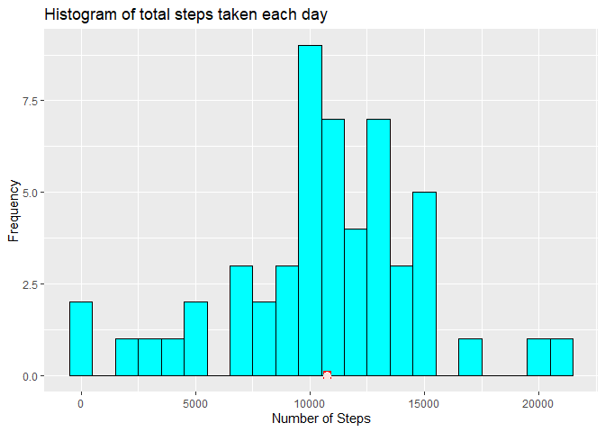
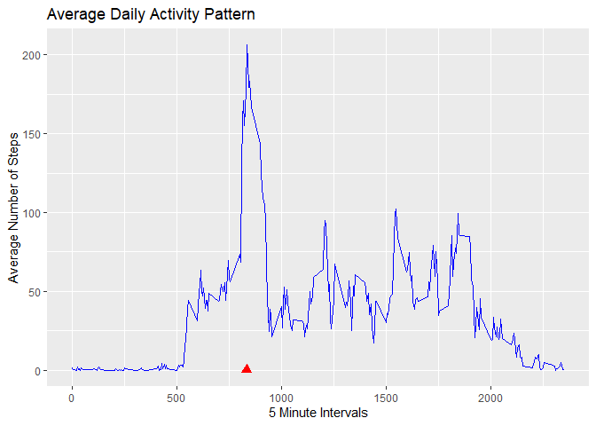
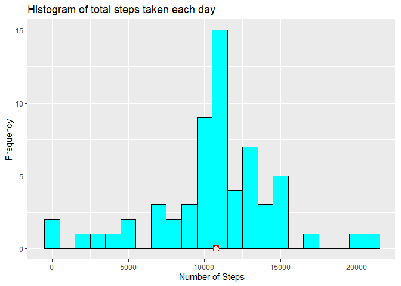
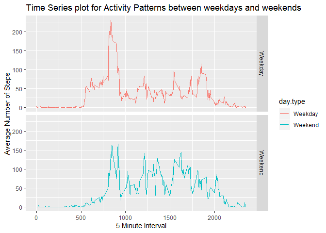

## Introduction :

It is now possible to collect a large amount of data about personal movement using activity monitoring devices such as a Fitbit, Nike Fuelband, or Jawbone Up. These type of devices are part of the “quantified self” movement – a group of enthusiasts who take measurements about themselves regularly to improve their health, to find patterns in their behavior, or because they are tech geeks. But these data remain under-utilized both because the raw data are hard to obtain and there is a lack of statistical methods and software for processing and interpreting the data.

This assignment makes use of data from a personal activity monitoring device. This device collects data at 5 minute intervals through out the day. The data consists of two months of data from an anonymous individual collected during the months of October and November, 2012 and include the number of steps taken in 5 minute intervals each day.


## Setting Global Option :

```r
library(knitr)
opts_chunk$set(echo=TRUE)
```

## Loading and preprocessing the data :

1. Checking if **Activity Monitoring Data** is already present, and if not then downloading the data.

```r
if(!file.exists("activity.zip")){
  download.file(url="https://d396qusza40orc.cloudfront.net/repdata%2Fdata%2Factivity.zip",
  destfile="./activity.zip")
}
```

2. Checking if the dataset is already unzipped, and if not then unzipping the data.

```r
if(!file.exists("activity.csv")){
  unzip(zipfile = "./activity.zip",exdir = ".")
}
```

3. Loading the activity data into a data frame

```r
activity <- read.csv(file = "activity.csv", header = T)
```

4. Changing the date column(character) into class date using as.Date

```r
activity$date <- as.Date(activity$date,format="%Y-%m-%d")
```

5. Removing the rows with missing observations and creating a new dataframe

```r
activityComplete <- activity[complete.cases(activity),]
```

6. Examining the complete activity dataset

```r
summary(activityComplete)
```

```
##      steps             date               interval     
##  Min.   :  0.00   Min.   :2012-10-02   Min.   :   0.0  
##  1st Qu.:  0.00   1st Qu.:2012-10-16   1st Qu.: 588.8  
##  Median :  0.00   Median :2012-10-29   Median :1177.5  
##  Mean   : 37.38   Mean   :2012-10-30   Mean   :1177.5  
##  3rd Qu.: 12.00   3rd Qu.:2012-11-16   3rd Qu.:1766.2  
##  Max.   :806.00   Max.   :2012-11-29   Max.   :2355.0
```

```r
str(activityComplete)
```

```
## 'data.frame':	15264 obs. of  3 variables:
##  $ steps   : int  0 0 0 0 0 0 0 0 0 0 ...
##  $ date    : Date, format: "2012-10-02" "2012-10-02" ...
##  $ interval: int  0 5 10 15 20 25 30 35 40 45 ...
```

## What is mean total number of steps taken per day?

__1. Histogram of the total number of steps taken each day__

The plot below shows the histogram of the total number of steps taken each day with binwidth of 1000 steps. The plot also has the mean and median of steps taken each day denoted by red square and mistrose filled circle respectively.


```r
library(ggplot2)
steps_each_day <- with(activityComplete, aggregate(steps~date,FUN=sum))
plt <- ggplot(steps_each_day,aes(x=steps))
plt+geom_histogram(binwidth = 1000,fill="cyan",col="black")+
  geom_point(x=mean(steps_each_day$steps),y=0,size=3,col="red",shape=15)+
  geom_point(x=median(steps_each_day$steps),y=0,size=3,col="mistyrose",shape=16)+
  labs(title="Histogram of total steps taken each day",x="Number of Steps",y="Frequency")
```

<!-- -->

__2.Mean and median number of steps taken each day__


```r
Meansteps <- round(mean(steps_each_day$steps),3)
Mediansteps <- round(median(steps_each_day$steps),3)
```
- **Mean Steps :  10766.189**
- **Median Steps :  10765**

## What is the average daily activity pattern?

The time series plot below shows the average daily activity pattern. The red traingle shows the 5 Minute interval for which average across all days has maximum number of steps.

__1. Time series plot of the 5-minute interval (x-axis) and the average number of steps taken, averaged across all days (y-axis)__


```r
avg_all_days <- with(activityComplete,aggregate(steps~interval,FUN=mean))
avg_all_days$interval <- as.integer(avg_all_days$interval)
ggplot(avg_all_days, aes(interval,steps))+
  geom_line(color='blue')+
  ggtitle("Average Daily Activity Pattern")+
  labs(x="5 Minute Intervals",y="Average Number of Steps")+
  geom_point(x=avg_all_days[which.max(avg_all_days$steps),1],y=0,color="red",shape=17,size=3)
```

<!-- -->

__2. The 5-minute interval that, on average, contains the maximum number of steps__


```r
maxinterval <- avg_all_days[which.max(avg_all_days$steps),1]
```
The 5-minute interval that, on average, contains the maximum number of steps is : **835**

## Imputing missing values

__1. Calculating and reporting the total number of missing values in the dataset (i.e. the total number of rows with NAs)__

```r
totalNAs <- sum(is.na(activity))
```
The total number of missing values in the dataset is : **2304**

__2. Strategy for filling all the missing values in the dataset__
__3. Creating a new dataset equal to original dataset but with no missing values__

__Strategy Used-__ We will impute the missing data with the average number of steps taken in the same interval across all days. This is because, in general, we find that the activities follow a daily pattern.
The code is - 

```r
activityImputed <- activity     # creating a new dataset in which we will impute the missing data
for (i in 1:length(activityImputed$steps)){
  if(is.na(activityImputed[i,"steps"])){
    missingInterval <- activityImputed[i,"interval"]
    for (j in 1:length(avg_all_days$interval)){
      if(missingInterval==avg_all_days[j,"interval"]){
        activityImputed[i,"steps"] <- avg_all_days[j,"steps"]
        break
      }
    }
  }
}
```

The new dataset __activityImputed__ gets created, which has no missing data. We can verify this as done below.


```r
sum(is.na(activityImputed$steps)) #Verifying that there is no missing data
```

```
## [1] 0
```

Also, summarizing the new dataset


```r
summary(activityImputed)
```

```
##      steps             date               interval     
##  Min.   :  0.00   Min.   :2012-10-01   Min.   :   0.0  
##  1st Qu.:  0.00   1st Qu.:2012-10-16   1st Qu.: 588.8  
##  Median :  0.00   Median :2012-10-31   Median :1177.5  
##  Mean   : 37.38   Mean   :2012-10-31   Mean   :1177.5  
##  3rd Qu.: 27.00   3rd Qu.:2012-11-15   3rd Qu.:1766.2  
##  Max.   :806.00   Max.   :2012-11-30   Max.   :2355.0
```

__4. Histogram of total number of steps taken each day and reporting its mean and median__

The plot below shows the histogram of the total number of steps taken each day with binwidth of 1000 steps. The plot also has the mean and median of steps taken each day denoted by red square and mistrose filled circle respectively.


```r
steps_each_day1 <- with(activityImputed, aggregate(steps~date,FUN=sum))
plt <- ggplot(steps_each_day1,aes(x=steps))
plt+geom_histogram(binwidth = 1000,fill="cyan",col="black")+
  geom_point(x=mean(steps_each_day1$steps),y=0,size=3,col="red",shape=15)+
  geom_point(x=median(steps_each_day1$steps),y=0,size=3,col="mistyrose",shape=16)+
  labs(title="Histogram of total steps taken each day",x="Number of Steps",y="Frequency")
```

<!-- -->

__2.Mean and median number of steps taken each day__


```r
Meansteps1 <- round(mean(steps_each_day1$steps),3)
Mediansteps1 <- round(median(steps_each_day1$steps),3)
```
- **Mean Steps :  10766.189**
- **Median Steps :  10766.189**

**Comparing the result of mean and median for the imputed dataset with the result of first part i.e. the mean and median of the dataset with missing values, it is found that the mean remains unchanged, whereas the median increases and becomes equal to mean, thereby making the distribution of total number of steps each day more normal.**

## Are there differences in activity patterns between weekdays and weekends?

For this part, we- 
1. Create new factor variable in the imputed dataset with two levels- "weekday" and "weekend".


```r
activityImputed$day.type <- ifelse(weekdays(activityImputed$date) %in% c("Saturday","Sunday"),"Weekend","Weekday")
activityImputed$day.type <- as.factor(activityImputed$day.type)
```

2. Compare the activity patterns of weekday and weekend, and see if there is any difference between the two. The comparison will be done using panel plot containing a time series plot between the 5 Minute Intervals and the average number of steps taken, averaged across all weekdays and weekends.


```r
avg_steps <- with(activityImputed,aggregate(steps~interval+day.type,FUN = mean))
ggplot(avg_steps,aes(x=interval,y=steps,color=day.type))+
  geom_line()+facet_grid(day.type~.)+
  ggtitle("Time Series plot for Activity Patterns between weekdays and weekends")+
  labs(x="5 Minute Interval",y="Average Number of Steps")
```

<!-- -->

**Conclusion :** On comparing the two time series plots of activity patterns on weekdays and weekends, we find that -
1. Within the interval 500-1000 (i.e. in morning), the activity on weekdays is more than the activity on weekends during the same interval. 
2. We also find that,activity during daytime (i.e. interval 1000 to 1750 approx.) on weekends is more, when compared to activity during daytime on weekdays. This, may be due to the fact that on weekdays, individual follow a work related routine, while on weekends they tend to go out for travel or shopping or other chores.
